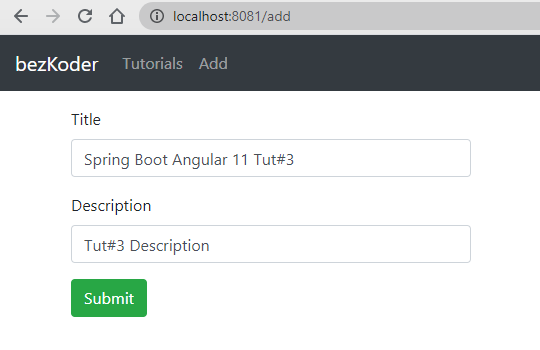
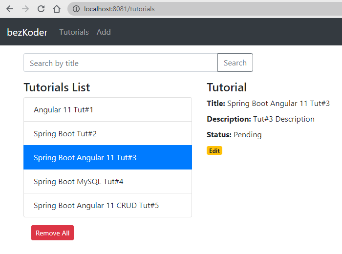
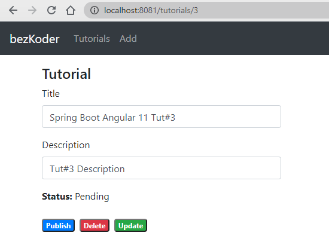
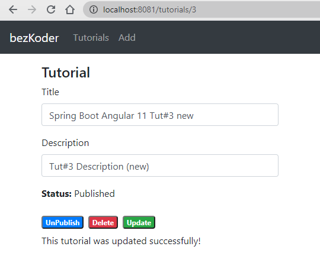
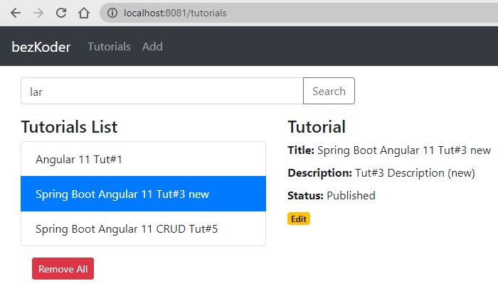
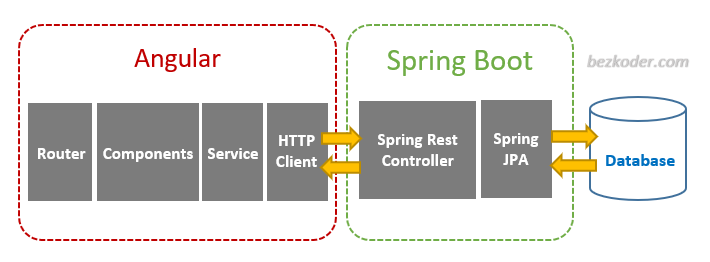

# Spring Boot + Angular 11 CRUD example with MySQL Database

For more details, please visit:
[https://bezkoder.com/angular-11-spring-boot-crud/](https://bezkoder.com/angular-11-spring-boot-crud/)

In this tutorial, we will learn how to build a full stack Angular 11 + Spring Boot example with a CRUD App. The back-end server uses Spring Boot with Spring Web MVC for REST Controller and Spring Data JPA for interacting with MySQL database. Front-end side is made with Angular 11, HTTPClient & Router.

We will build a full-stack Tutorial Application in that:

- Each Tutorial has id, title, description, published status.
- We can create, retrieve, update, delete Tutorials.
- We can also find Tutorials by title.
- The images below shows screenshots of our System.

Add an object:

Retrieve all objects:

Click on **Edit** button to go to a Tutorial page:

On this Page, you can:

- change status to *Published* using **Publish** button
- delete the Tutorial using **Delete** button
- update the Tutorial details with **Update** button

Search Tutorials by title:

## Angular 11 & Spring Boot CRUD Architecture
This is the application architecture we will build:

- Spring Boot exports REST Apis using Spring Web MVC & interacts with MySQL Database using Spring Data JPA.
- Angular Client sends HTTP Requests and retrieve HTTP Responses using axios, shows data on the components. We also use Angular Router for navigating to pages.

## Video
This is our Angular Spring Boot CRUD application demo and brief instruction, running with MySQL database:

In the video, we use Angular 10, but it has the same logic & UI as Angular version 11 in this tutorial.

# More Practice

You will want to know how to run both projects in one place:
> [How to Integrate Angular with Spring Boot Rest API](https://bezkoder.com/integrate-angular-spring-boot/)

Server side Pagination:
> [Pagination with Angular + Spring Boot example](https://bezkoder.com/pagination-angular-10-spring-boot/)

File Upload:
> [Angular 11 + Spring Boot: File upload example](https://www.bezkoder.com/angular-11-spring-boot-file-upload/)

Security:
> [Angular 11 + Spring Boot: JWT Authentication & Authorization example](https://bezkoder.com/angular-11-spring-boot-jwt-auth/)

Serverless with Firebase:
> [Angular 11 Firebase CRUD Realtime DB | AngularFireDatabase](https://bezkoder.com/angular-11-firebase-crud/)

> [Angular 11 Firestore CRUD example | AngularFireStore](https://bezkoder.com/angular-11-firestore-crud-angularfirestore/)
